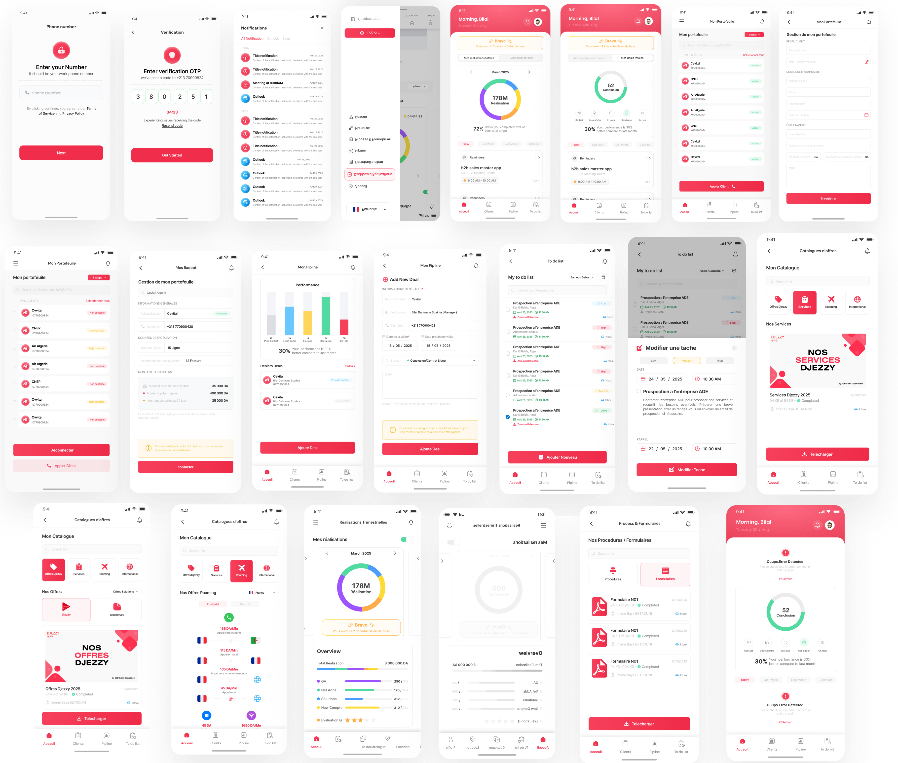

# DJEZZY - B2B Sales Master

An internal enterprise application built for Djezzy’s B2B Sales teams.
The project consists of a **web platform for supervisors** and a **mobile app for sales representatives**, enabling efficient client management, deal tracking, task organization, and performance monitoring.

## 🚀 My Role

### **Project Manager**
- Coordinated a multidisciplinary team (backend dev, web dev, designer, additional dev).
- Led meetings with project owner and cross-department teams .
- Validated UI/UX, backend deliverables, workflows, and business logic.
- Prepared all architectural documentation:
  - **HLD (High-Level Design)**
  - **LLD (Low-Level Design)**
  - **Tech stack & versioning**
  - **VM/server specification requirements**
  - **Connectivity matrices** for PROD & UAT environments

### **Mobile Developer (Flutter)**
- Fully developed the mobile application from scratch.
- Implemented **MVC architecture**.
- Integrated all APIs with the backend.
- Delivered pixel-perfect UI faithfully matching the designer’s components.

## 📱 Mobile App – Main Features

### **Authentication**
- Secure login with (otp) and session handling

### **Notifications**
- Push notifications using firebase topics 

### **Clients**
- View clients details .
- Check subscription & payment status
- Quick contact actions

### **Pipeline**
- Dashboard showing the status of ongoing client acquisition
- Deal tracking (create, edit, update status)
- Statuses like: *prise de contact, dépôt d’offre, en cours, conclusion, on hold…*

### **To-Do List**
- Tasks created by the sales rep or assigned by supervisors
- Add, edit, mark as completed
- Filters and status tracking

### **Offers Catalog**
- Access to company offers & pricing documents
- Benchmark comparisons with competitors
- Roaming and international pricing sections

### **Performance Dashboard**
- Quarterly achievements visualized with charts
- KPIs for conversions, acquisition progress, etc.

### **Process & Forms**
- Download internal procedures and forms

### **Outlook Integration**
- Integration with the company’s Outlook system
